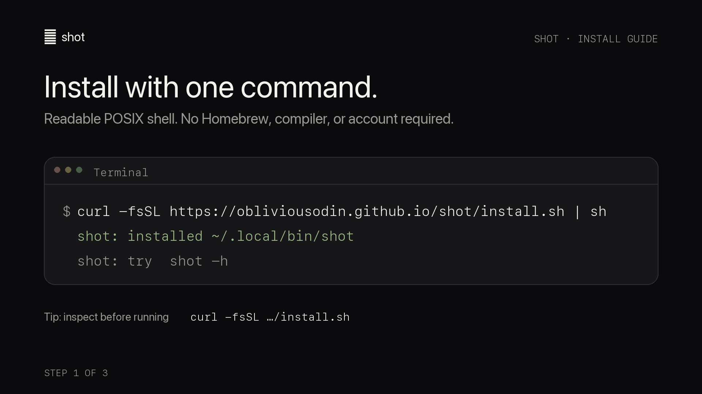
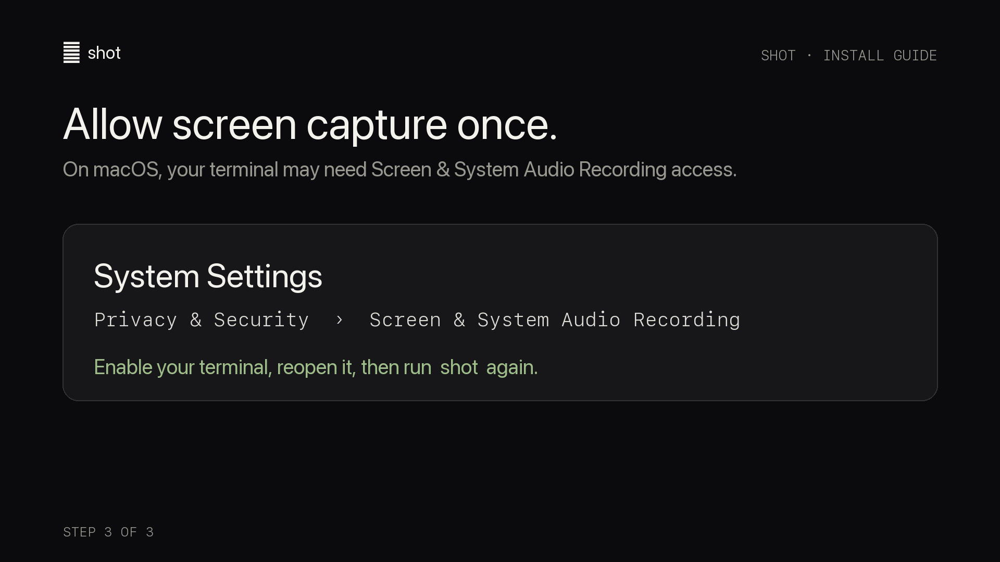
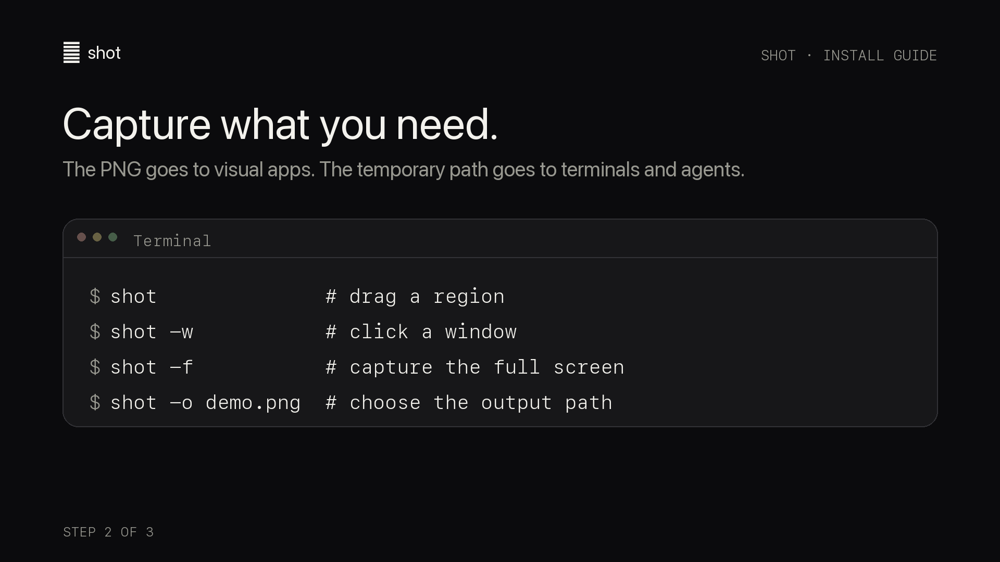
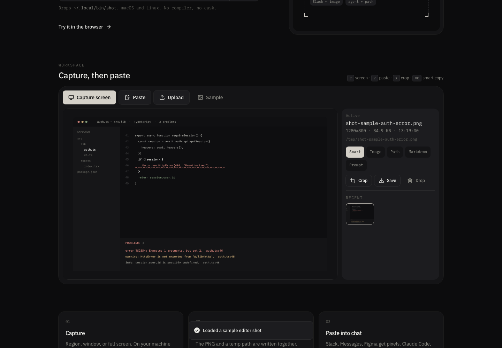

# shot

**Screenshots that paste into the right thing.**

A lightweight take on [Screenshot for Chat](https://github.com/obra/ScreenshotForChat). Capture a region, window, or screen. The **image** goes to visual apps, while the **temporary file path** goes to terminals and coding agents.

[Open the browser workspace](https://obliviousodin.github.io/shot/) · [View the installer](https://obliviousodin.github.io/shot/install.sh)



_Illustrated walkthrough. The installer prints the expanded absolute install path on your machine._

## Install

`shot` is a readable POSIX shell script. It does not require Homebrew, Swift, or an account.

```sh
curl -fsSL https://obliviousodin.github.io/shot/install.sh | sh
```

The installer writes `shot` to `~/.local/bin/shot`. If that directory is not already on your `PATH`, add this line to your shell configuration (`~/.zshrc`, `~/.bashrc`, or equivalent):

```sh
export PATH="$HOME/.local/bin:$PATH"
```

Then open a new terminal and verify the installation:

```sh
command -v shot
shot -h
```

Want to inspect the installer first? Download it, read it, and then run it:

```sh
curl -fsSL https://obliviousodin.github.io/shot/install.sh -o install-shot.sh
less install-shot.sh
sh install-shot.sh
rm install-shot.sh
```

### macOS permission

On first capture, macOS may require your terminal to have **Screen & System Audio Recording** access:

1. Open **System Settings → Privacy & Security → Screen & System Audio Recording**.
2. Enable the terminal app you use.
3. Quit and reopen that terminal, then run `shot` again.



## Usage

```sh
shot              # drag a region (default)
shot -w           # click a window
shot -f           # capture the full screen
shot -o demo.png  # choose the output path
shot -h           # show help
```



After a successful capture:

- Image-aware apps such as Slack, Messages, and Figma receive the PNG.
- Text-aware apps such as terminals and coding agents receive the file path.
- The path is also printed to standard output.

Without `-o`, files are written to `$TMPDIR` as `shot-YYYYMMDD-HHMMSS.png`. Treat them as temporary files.

## Requirements

### macOS

`screencapture` is built into macOS. `shot` uses AppKit to place the PNG and its path on the same pasteboard.

### Linux

Install one capture backend and one clipboard tool:

| Role | Supported tools |
| --- | --- |
| Capture | `grim` + `slurp` (Wayland), `maim`, `gnome-screenshot`, `scrot`, or ImageMagick `import` |
| Clipboard | `wl-copy` (Wayland), `xclip` (X11), or `xsel` as a best-effort X11 fallback |

With `wl-copy` or `xclip`, the image goes to the clipboard and the path goes to the primary selection. `xsel` does not declare the PNG MIME type, so image pasting depends on the receiving application; the path remains available from the primary selection.

## Browser workspace

The browser workspace can capture a shared screen, accept a pasted or uploaded image, crop it, copy the image, and generate text formats around a virtual path label. Processing stays in the browser, but the displayed `/tmp/shot-….png` value is **not** a file created on your computer. Choose **Save**, then use the downloaded file’s actual location with any path, Markdown, or prompt workflow that needs a real file.

[Open the hosted workspace](https://obliviousodin.github.io/shot/), or run it locally:

```sh
git clone https://github.com/ObliviousOdin/shot.git
cd shot
npm ci
npm run dev
```

Then open <http://127.0.0.1:8080/>.



## Development

```sh
npm ci
npm test
npm run typecheck
npm run lint
npm run build
```

## License

MIT. Inspired by Jesse Vincent’s Screenshot for Chat.
